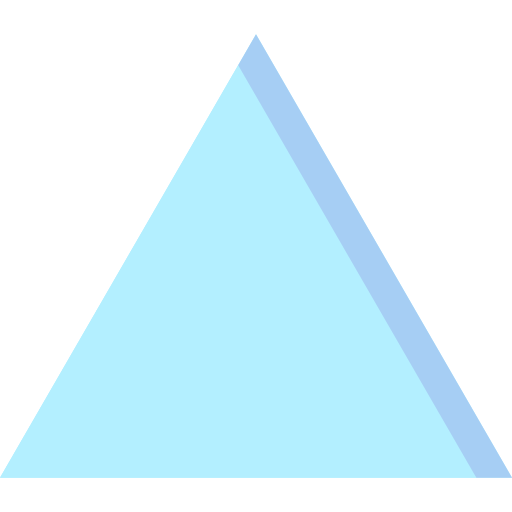
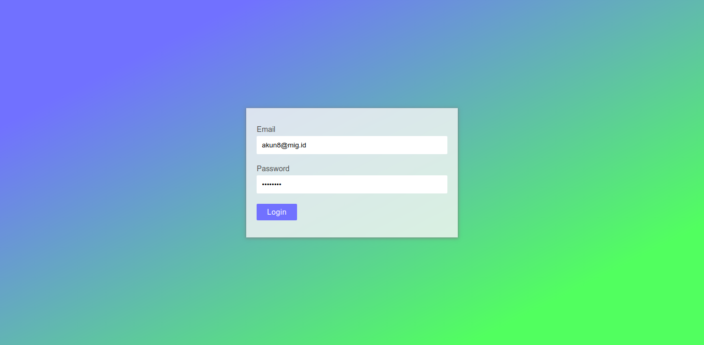
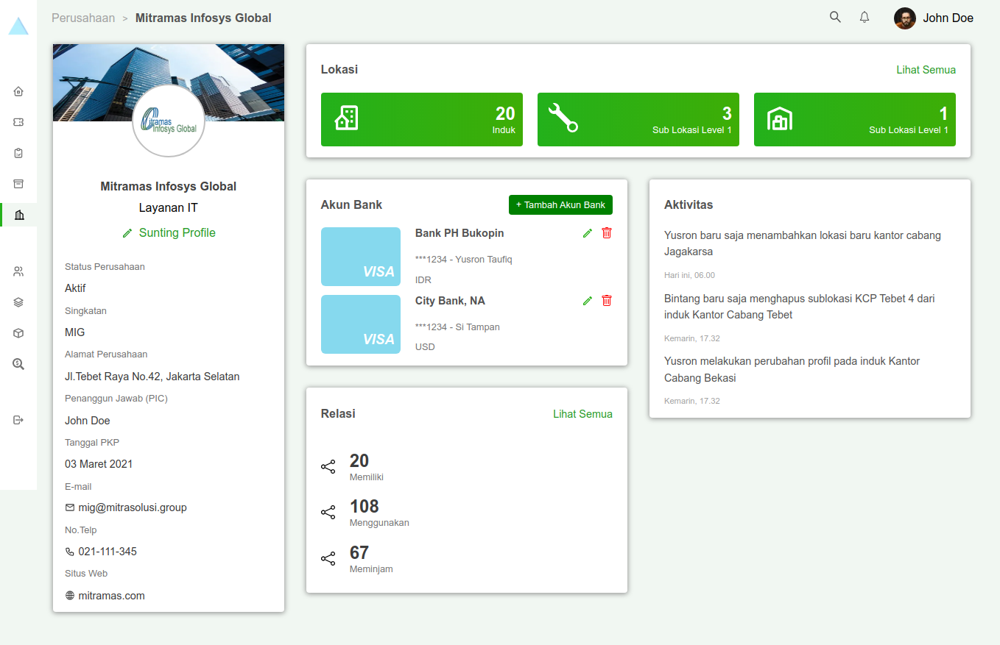
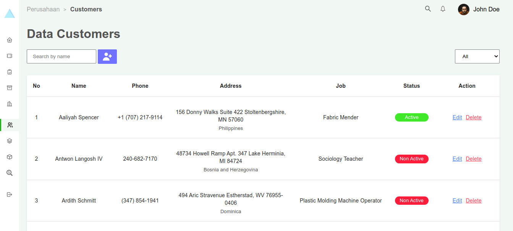

<div align="center">

<!-- PROJECT LOGO -->



</div>

# MIG Dashboard

<table>
<tr>
<td>
MIG Dashboard is the pre-test of the recruitment process for Front-End Developer posisition in Mitramas Infosys Global ( MIG )
</td>
</tr>
</table>

## Demo

Here is a working live demo : https://migdashboard-rizalyoga.netlify.app

## Video


https://user-images.githubusercontent.com/28485636/204466081-385157b6-6622-4de2-b958-d77268528625.mp4


## Site

### Login Page



### Dashboard Page



### Customers Page



## Features

- Sign in and sign out account.
- See all the list of customer.
- Create new customer.
- Edit customer data.
- Delete customer data.
- Search customer data by name.
- filter list customer by active or non active status

## Run in locale

To clone and run this website, you'll need [Git](https://git-scm.com) and [Node.js](https://nodejs.org/en/download/) (which comes with [npm](http://npmjs.com)) installed on your computer. From your command line:

```bash
# Clone this repository
$ git clone https://github.com/rizalyoga/dashboard-mig.git

# Go into the repository
$ cd dashboard-mig

# Install dependencies
$ npm install

# Run the app
$ npm run dev
```

## Built with

- [Next JS](https://nextjs.org/) - Next.js is an open-source web development framework built on top of Node.js enabling React-based web applications functionalities such as server-side rendering and generating static websites.

- [Netlify](https://www.netlify.com/) - Netlify is a San Francisco–based cloud computing company that offers hosting and serverless backend services for web applications and static websites.
